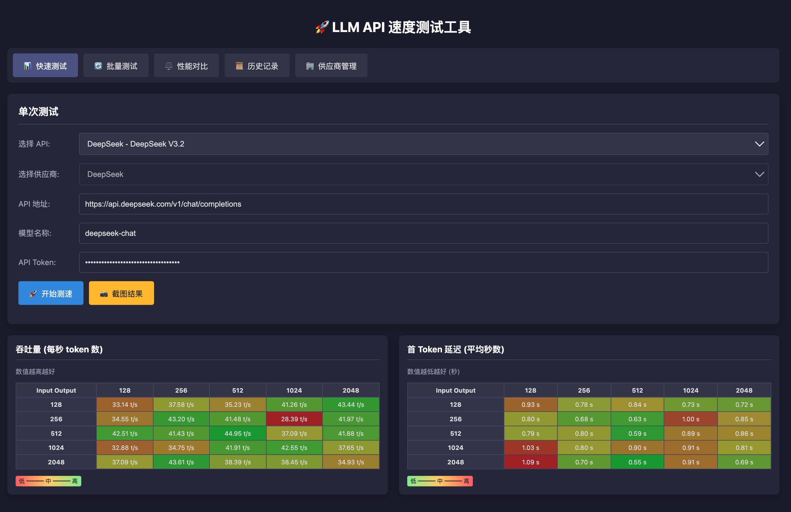
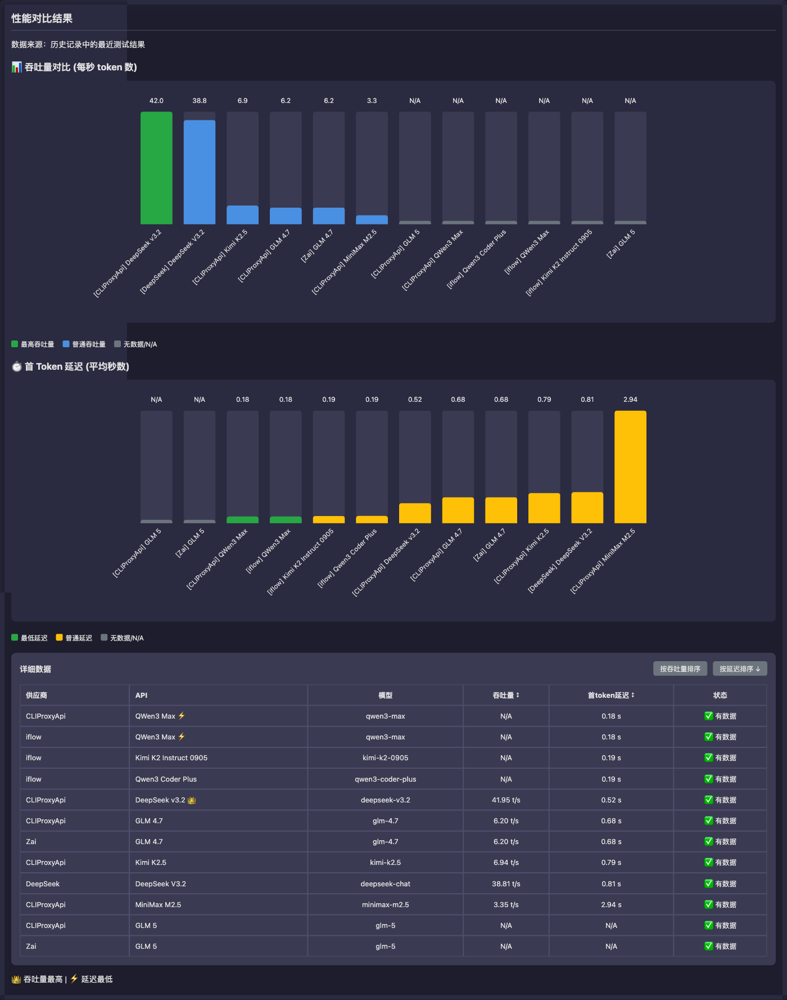

# LLM API Speed & Latency Test Tool

This is a tool for testing the call speed and performance of Large Language Model (LLM) APIs. It measures throughput (tokens/sec) and average first-token response latency for various input and output token combinations.




## ✨ Features

*   **Custom API Endpoint**: Test any LLM API endpoint compatible with the OpenAI streaming interface.
*   **Model Name Specification**: Input the specific model name to be tested.
*   **API Token (Optional)**: Supports APIs requiring authentication.
*   **Provider Management**: Centrally manage multiple API providers' base URLs and default tokens for quick configuration.
*   **API Management**: Support grouping APIs by provider, tag filtering, and batch addition.
*   **Batch Testing**: Support testing multiple APIs simultaneously, with parallel or sequential execution options for quick performance comparison.
*   **Performance Comparison**: Visualize and compare throughput and latency across multiple APIs.
*   **History Records**: Automatically save test history, supporting viewing, comparing, and deleting historical records.
*   **Screenshot Function**: One-click screenshot to save test results.
*   **Performance Matrix**:
    *   **Throughput (Tokens/sec)**: Displays throughput in a table for different combinations of input and output token counts. Higher is better.
    *   **Average First Token Wait Time (seconds)**: Shows the average latency for the corresponding combinations. Lower is better.
*   **Dynamic Color Highlighting**: Test results are color-coded based on performance, making it easy to identify bottlenecks quickly.
*   **Pure Frontend Logic**: All tests are initiated from the user's browser. The server serves only this single-page application.

## 🚀 How to Use

This tool is designed for deployment as a single file, embedding all HTML, CSS, and JavaScript.

**Start Testing:**

1.  Start the server:
    ```bash
    npm start
    # or
    node server.js
    ```
2.  Open your browser and visit `http://localhost:3000`.
3.  Add API providers in the "Provider Management" page (optional, for quick configuration).
4.  Add APIs to be tested in the "API Management" page.
5.  Go to "Quick Test", "Batch Test", or "Performance Comparison" page to start testing.

## 🛠️ Technical Details

*   **Frontend**: HTML, CSS, and plain JavaScript.
*   **Backend**: Node.js + native HTTP module.
*   **Data Storage**: JSON file storage (`data.json`).
*   **API Calls**: Uses the browser's `fetch` API to call LLM APIs in a streaming fashion.
*   **Performance Metrics**:
    *   **First Token Latency**: Time from sending the request to receiving the first data chunk. To reduce fluctuations, multiple tests are run per cell, and the average is taken.
    *   **Throughput**: (Approximate Output Tokens) / (Total Response Time). Output tokens are approximated by counting received characters and dividing by an average (e.g., 4 chars/token).
*   **Token Approximation**: As the frontend cannot directly access model-specific tokenizers, input token counts are simulated by generating placeholder text of a certain length. Output token counts are estimated based on the actual characters received.

## 📝 Notes and Limitations

*   **Token Approximation Accuracy**: Token counts are approximate. Actual token numbers can vary based on the model and text content.
*   **Network Fluctuations**: Test results are affected by the user's current network environment. It's advisable to test multiple times or under different network conditions for a comprehensive understanding.
*   **Browser Limitations**: A large number of concurrent requests or prolonged tests might be limited by browser resources.
*   **API Rate Limits**: Be mindful not to exceed the rate limits of the target LLM API, as this could lead to failed tests or account issues.
*   **CORS**: The tool makes requests directly from the browser to the target API. If the target API is not correctly configured for CORS (Cross-Origin Resource Sharing) to allow requests from your domain, the tests will fail. Most public LLM APIs have relatively permissive CORS policies.

## 💡 Potential Future Improvements

*   [ ] Support for importing/exporting test configurations and results.
*   [ ] More accurate token calculation (if a lightweight tokenizer can be integrated).
*   [x] Backend implementation for the "Share Results" feature.
*   [ ] Visual charts to display historical test data.

## 🙏 Acknowledgments

This project is based on the original [LLM API Speed Tester](https://github.com/JohnMing143/llm-api-speedtester) for extended development. The original version is a lightweight testing tool deployed on Cloudflare Pages. Thanks to the original author for the open source contribution.

## 🤝 Contributing

Feel free to open issues or submit pull requests!

## 📄 License

This project is licensed under the [MIT License](LICENSE).